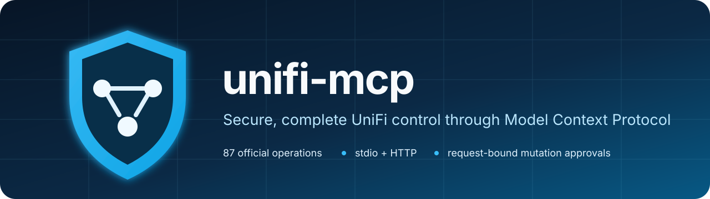

<p align="center">
  
</p>

<p align="center">
  <a href="https://github.com/dennispayne/unifi-mcp/actions/workflows/dotnet.yml"></a>
  <a href="https://github.com/dennispayne/unifi-mcp/security/code-scanning"></a>
  <a href="https://github.com/dennispayne/unifi-mcp/releases"></a>
  <a href="LICENSE"></a>
</p>

**unifi-mcp** connects MCP-compatible AI clients to UniFi Site Manager,
UniFi Network, UniFi Protect, UniFi Access, and UniFi Mobility through a
security-focused, scope-aware proxy. It supports read-only workflows and
explicitly approved mutations without exposing API keys to the model.

> This is an independent community project and is not affiliated with or
> endorsed by Ubiquiti Inc.

## Highlights

- **Complete documented API surface:** 275 operations across Site Manager,
  UniFi Network, UniFi Protect, UniFi Access, and UniFi Mobility.
- **Any number of scopes:** connect multiple consoles, sites, or credentials
  through one server.
- **Two transports:** self-contained stdio and HTTP executables.
- **Security by default:** path and method allowlists, strict TLS validation,
  optional certificate pinning, bounded output, and identifier redaction.
- **Safe mutations:** one-time HMAC approvals bound to the exact scope,
  method, path, request body, and expiration.
- **Efficient MCP output:** concise summaries and hard response budgets reduce
  unnecessary model context and token spend.

## Install

Download the archive for your platform from
[GitHub Releases](https://github.com/dennispayne/unifi-mcp/releases):

| Platform | Archive |
| --- | --- |
| Windows x64 / ARM64 | `.zip` |
| Linux x64 / ARM64 | `.tar.gz` |
| macOS Intel / Apple silicon | `.tar.gz` |

Verify the archive using `SHA256SUMS.txt`, then extract it. Each package
contains self-contained `stdio` and `http` hosts; installing .NET is not
required.

## Quick start

1. Copy `config/unifi-mcp.settings.example.json` to
   `config/unifi-mcp.settings.json`.
2. Adjust the example base addresses, scopes, allowed paths, and certificate
   pin for your environment.
3. Set the environment variables named by each credential entry.
4. Launch the stdio executable with the configuration path.

```powershell
.\stdio\UnifiMcp.Stdio.exe --config .\config\unifi-mcp.settings.json
```

The included example uses generic environment-variable names. A local
configuration may use any names; only the MCP process must inherit matching
values. Never store API keys in JSON configuration or command arguments.

## GitHub Copilot CLI

Add the packaged stdio host to `%USERPROFILE%\.copilot\mcp-config.json`:

```json
{
  "mcpServers": {
    "unifi": {
      "type": "stdio",
      "command": "C:\\Tools\\unifi-mcp\\stdio\\UnifiMcp.Stdio.exe",
      "args": [
        "--config",
        "C:\\Tools\\unifi-mcp\\config\\unifi-mcp.settings.json"
      ],
      "tools": [
        "unifi.scopes.list",
        "unifi.scopes.get",
        "unifi.scope.read",
        "unifi.api.operations.list",
        "unifi.api.operation.get",
        "unifi.api.request",
        "unifi.site_manager.hosts.list",
        "unifi.site_manager.sites.list",
        "unifi.site_manager.devices.list",
        "unifi.site_manager.isp_metrics.get",
        "unifi.network.info.get",
        "unifi.network.sites.list",
        "unifi.network.devices.list",
        "unifi.network.clients.list",
        "unifi.network.networks.list",
        "unifi.network.wifi.list",
        "unifi.network.device.statistics.get",
        "unifi.protect.info.get",
        "unifi.protect.cameras.list",
        "unifi.protect.sensors.list",
        "unifi.protect.nvrs.get",
        "unifi.access.doors.list",
        "unifi.access.devices.list",
        "unifi.mobility.workspaces.list",
        "unifi.mobility.devices.list"
      ]
    }
  }
}
```

Restart the client or reload MCP servers after saving the file.

## Multiple credentials and scopes

Configuration separates reusable credentials from access scopes:

- A **credential** names an environment variable, API-key header, and an
  optional header value prefix such as `Bearer` for UniFi Access tokens.
- A **scope** selects a credential, service, base address, path boundary,
  allowed methods, mutation policy, and TLS settings.

Add as many credentials and scopes as needed. Secret values never belong in
the settings file.

## Tools and API coverage

Concrete tools provide compact results for common inventory and health
requests. Three generic tools expose the remaining official API surface:

- `unifi.api.operations.list`
- `unifi.api.operation.get`
- `unifi.api.request`

The embedded catalog includes 14 Site Manager v1.0.0, 73 Network v10.4.57,
73 Protect v7.1.87, 107 Access v4.0.10, and 8 Mobility v1.0.0 operations.
See [API coverage](docs/api-coverage.md) for per-service base paths,
authentication headers, and permission requirements.

UniFi Talk and UniFi Connect have no official public REST API and are not
included. UniFi Identity operations are published inside the UniFi Access
contract and are reachable through the `access` service.

## Mutations

Mutations are disabled unless a scope explicitly enables them and allows the
requested HTTP method. Every POST, PUT, PATCH, or DELETE also requires a
short-lived, one-time approval token.

Generate a token outside the running MCP process:

```powershell
$token = .\stdio\UnifiMcp.Stdio.exe --create-mutation-approval `
  --scope network `
  --method POST `
  --path '/v1/sites/<site-id>/networks' `
  --body-file mutation-body.json
```

The command reads the mutation approval key from its environment and prints
only the token. The eventual MCP call must use the exact same scope, method,
path, and JSON body.

## HTTP transport

Set these inherited environment variables as needed:

| Variable | Purpose |
| --- | --- |
| `UNIFI_MCP_HTTP_URLS` | Listener URLs; defaults to loopback |
| `UNIFI_MCP_HTTP_AUTH_TOKEN` | Required for non-loopback binding |
| `UNIFI_MCP_HTTP_ALLOWED_ORIGINS` | Semicolon-separated browser origin allowlist |

Launch `UnifiMcp.Http` with `--config`. The MCP endpoint is `POST /mcp`; health
checks use `GET /healthz`.

## Security

unifi-mcp validates official operations before network access, rejects path
escape attempts and reserved authentication headers, caps request and response
sizes, redacts common infrastructure identifiers, and never offers a TLS
validation bypass.

Read [SECURITY.md](SECURITY.md) before enabling mutations or remote HTTP
access.

## Build from source

Requirements: .NET SDK 10.0.302 or a compatible feature-band SDK selected by
`global.json`.

```powershell
dotnet build UnifiMcp.slnx --configuration Release
dotnet run `
  --project tests\UnifiMcp.Tests\UnifiMcp.Tests.csproj `
  --configuration Release `
  --no-build
```

To reproduce the CI coverage report locally, install the pinned tool and run:

```powershell
dotnet tool install --global dotnet-coverage --version 18.9.0
dotnet-coverage collect --output artifacts/coverage/coverage.cobertura.xml `
  --output-format cobertura -- `
  dotnet run --project tests\UnifiMcp.Tests\UnifiMcp.Tests.csproj `
  --configuration Release --no-build
```

The configured per-assembly and overall line and branch floors are in
[`config/coverage-thresholds.json`](config/coverage-thresholds.json). CI
publishes both the Cobertura XML and an HTML report as the `coverage-reports`
artifact. Assemblies that the test run never loads are reported as 0%
and are still evaluated against their configured floors.

## Documentation

- [Architecture](docs/architecture.md)
- [API coverage](docs/api-coverage.md)
- [Security policy](SECURITY.md)

## License

[MIT](LICENSE)
