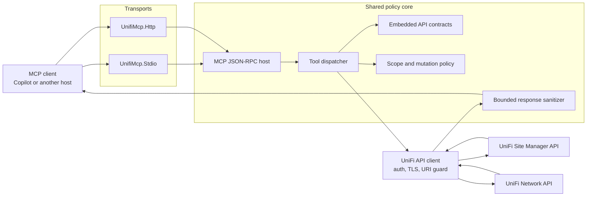
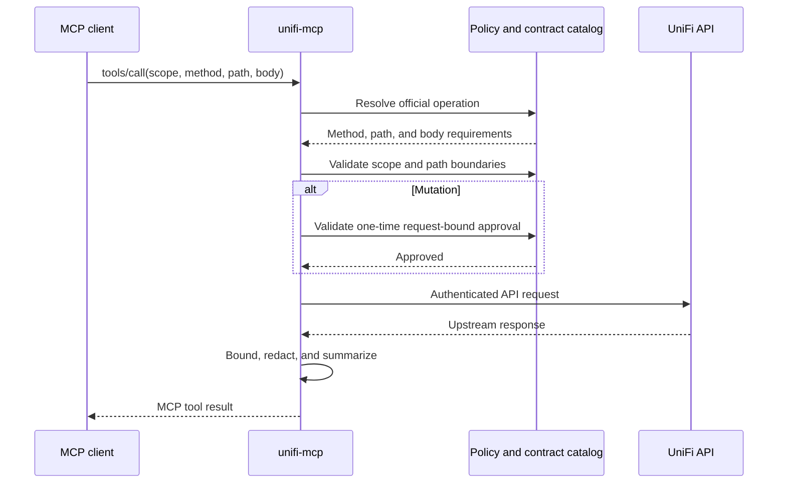

# Architecture

unifi-mcp is a policy-enforcing bridge between MCP clients and UniFi APIs.
Both transports share the same authentication, scope, validation, redaction,
and response-bounding code.

## Components

| Project | Responsibility |
| --- | --- |
| `Unifi.Mcp.Client` | Authentication, TLS, URI construction, and scope enforcement |
| `UnifiMcp.Core` | MCP tools, JSON-RPC, contracts, policy, and sanitization |
| `UnifiMcp.Stdio` | Newline-delimited stdio transport and approval-token CLI |
| `UnifiMcp.Http` | ASP.NET Core HTTP transport |

## Runtime flow

1. A host resolves an explicit `--config` path, `UNIFI_MCP_CONFIG`, or a config file directly under the current working/application directory.
2. `UnifiMcpConfigurationLoader` validates the shared runtime config.
3. `UnifiMcpRuntime` converts named credentials/scopes into low-level UniFi access profiles.
4. `UnifiMcpServer` exposes concrete tools plus contract-driven generic tools.
5. `McpJsonRpcHost` handles protocol framing and JSON-RPC for both hosts.
6. Responses pass through shared sanitization before becoming model-visible.

## Transport split

- `UnifiMcp.Stdio`: one newline-delimited JSON-RPC message per stdin/stdout line, with an input-size cap and per-message error containment.
- `UnifiMcp.Http`: ASP.NET Core JSON-RPC endpoint with origin validation, content negotiation, request-size cap, and a bearer-token gate that is mandatory for remote bindings.

Both transports use the same `McpJsonRpcHost` and `UnifiMcpServer`.

## Security boundaries

- Each profile combines a fixed base address, service kind, relative-path allowlist, HTTP-method allowlist, and explicit mutation setting.
- Non-GET MCP calls require scope-level mutation enablement plus a one-time HMAC approval token generated outside the MCP and bound to the exact request.
- An embedded catalog describes all 87 operations in the official Site Manager v1.0.0 and Network v10.4.57 contracts.
- Response bodies are streamed through a byte cap before centralized JSON sanitization.
- Sanitization removes secrets and common device/network identifiers and enforces collection, property, string, aggregate-output, and recursion-depth budgets.
- A configured SHA-256 certificate pin is always compared exactly; no TLS bypass is available.

## Why named credentials and scopes?

Credentials name an environment-variable source. Scopes independently define
the service, base address, allowed paths, allowed methods, mutation policy,
and optional TLS pin. This supports any number of UniFi access paths without
copying secret values into configuration.
